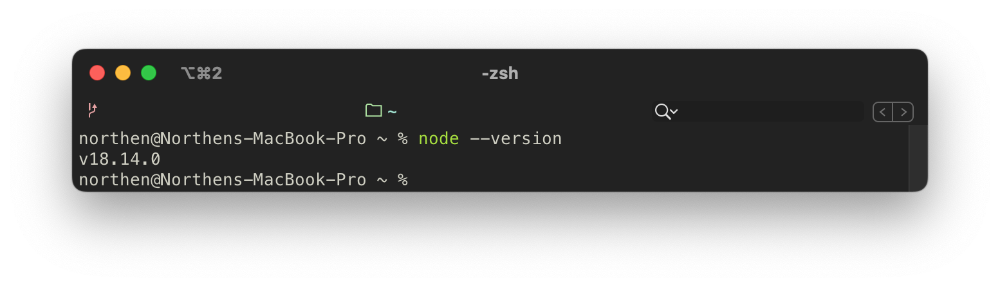
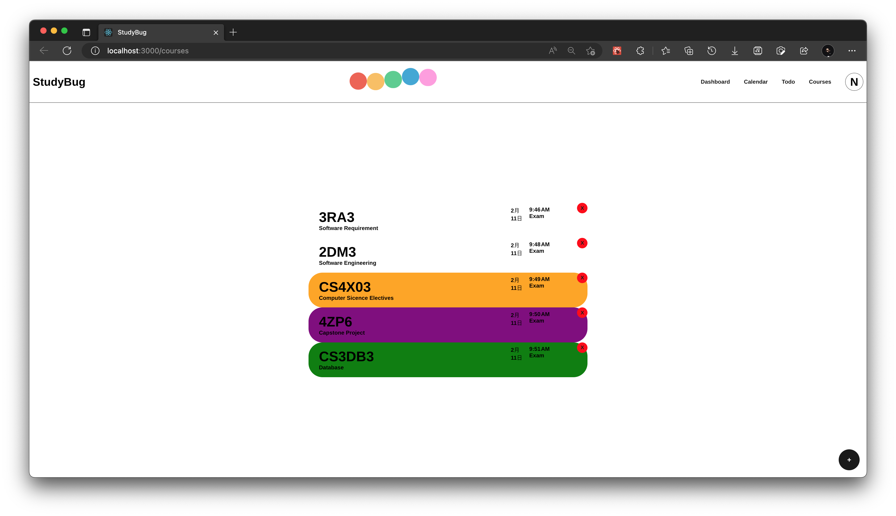

# StudyBug Academic Planner

> 🔗GitLab Repository: [NorthenYR/StudyBug (github.com)](https://github.com/NorthenYR/StudyBug)
>

## 💡Overview

**StudyBug Academic Planner** is a web application that helps university students to schedule their academic tasks and plan their semesters, academic years or overall degree.

It offers features for users to input details about each of their courses, assignments, tests and deadlines and calculate grades. Users will be able to view their courses and goals in an overall dashboard view as well as a calendar view by month, week, day, etc. and check them off a to-do list, tracking their grades and progress as they go. Additionally, students will be able to generate a weekly study plan based on their schedule and assignment priority/difficulty. The strategy for this product is to combine and expand upon the best features of the similar calendar, to-do list, time management and academic planning applications in one place and for students to be able to use the application throughout their entire academic career. The web application is developed using the **MERN** Stack which includes **M**ongoDB, **E**xpress, **R**eact and **N**ode.

### Concept

The concept of StudyBug Academic Planner originates from a set of time management strategies employed by one of the development team members for several years throughout his undergraduate career. There are indeed many time management applicants in the market including calendar planners, timetable planners, to-do list organizers, habit development monitors, progress monitors, count-down timers, etc.; however, at that time, and even until today, there is not a single application that integrates all useful time management features of these applications into one individual system. And those applications also lack designated features that are necessary for the group of university students. As an undergraduate student who experiences the intense tempo of academic life, he knows what is best for students and he decided to design a conceptual academic planner from scratch on paper.


StudyBug Academic Planner is a capstone project and is supervised by McMaster University, Faculty of Engineering, Computer Science Program (Year of 2022/2023). Development team members are able to learn approaches to perform the entire software development process and understand the software life cycle in practice. Development team members will also demonstrate their understanding of the computing and software industry, their proficiency in technical knowledge and their skills in programming. The software strategy is using the MERN Stack to implement a web application that runs on modern web browsers, which is cross-platform and cross-device.

With the opportunity of developing a capstone project, StudyBug Academic Planner realizes the handwritten conceptual system into a computerized web application. It performs the whole set of academic planning logic in a more effective and reliable way and can benefit more university students.

### Features

The core feature of StudyBug Academic Planner is providing a planner that allows students to monitor courses in a top-down manner:

- Users will be able to add the details for each of their current courses including, lecture schedules, assignments, tests, and syllabus information.
- Added assignments, labs, and tests will include weights, deadlines, and relevant links.
- The application will generate corresponding tasks based on course information such as a lecture review task, a reading task, or a note-organizing task.
- Students can return to the course homepages they create throughout the semester to record assessment marks, monitor in-progress grades and calculate the minimum mark requirements for outstanding assessments depending on their goals.
- Course details and study tasks will be viewable on the Calendar
- The same tasks will also be viewable on the to-do list in more detail where users can check them off
- Each course will be clearly highlighted in a unique colour across the application
- Users will be able to add non-academic tasks to the calendar and to-do list
- Tasks on the calendar and to-do list will be taggable and filterable

StudyBug Academic Planner also provides a rich set of course-management and time-management features, including:

- Users will also be able to access the degree planning section from the Dashboard where they can track and view the progress of their entire degree

### Why StudyBug?

StudyBug Academic Planner is a software intended to help university students better manage their schedules and plan their degrees. Correctly and effectively using this software will significantly help university students do better in time management, schedule organization and self-discipline and present a better academic performance. Potential users including but not limited to university faculty administrative staff, instructors, teaching assistants, students’ parents and university non-faculty staff are also able to benefit from this software in their daily planning.

The application is a new and self-contained academic planner that helps students to plan semesters and manage their time. There are similar applications in the market such as [iCloud Calendar](https://www.icloud.com/calendar), [Google Calendar](https://www.google.com/calendar), [Outlook Calendar](https://outlook.office.com/calendar), [Google Keep](https://keep.google.com/), [TickTick](https://ticktick.com/?language=en_US), etc. There are many other generalized planners, to-do list organizers and habit trackers available online as well as internal academic planners such as McMaster’s [MyTimeTable](https://mytimetable.mcmaster.ca/criteria.jsp) or [Avenue to Learn](https://avenue.mcmaster.ca/). However, there are few, free solutions available for students to manually track their progress in classes and in their degrees and organize their study time around their life. This application aims to provide a solution to this problem and it combines and expands upon the best features of the similar calendar, to-do list, time management and academic planning applications in one place and for students to be able to use the application throughout their entire academic career.


## 🚀Installation

> - If you have already had Node.js and npm installed on your computer but this is your first time executing StudyBug, click [here](#First Time Execution) to skip **Requirement** section.
>
> - For first-time executing StudyBug, see **[First-Time Execution](#First-Time Execution)** section.
> - If this is not your first time executing StudyBug, see **[Regular Execution](#Regular Execution)** section.

### Requirement

[](https://nodejs.org/en/)

StudyBug Academic Planner web application is programmed in TypeScript programming language, which is a JavaScript variation. In order to run the web application, the JavaScript runtime environment, namely Node.js, is necessary.

Please install Node.js to your computer from this link: [Node.js (nodejs.org)](https://nodejs.org/en/). 

> If the installer asks if you want to install npm as well, please answer yes. For more information, see [below](#npm).

Once Node.js has been successfully installed, execute the below command in the terminal 

```
node --version
```

and you should be able to see the version of Node.js like:



<a name="npm">[](https://commons.wikimedia.org/wiki/File:Npm-logo.svg)</a>

In order to install the necessary Node.js packages and modules to compile the web application, you need [npm](https://www.npmjs.com/), the Node Package Manager.

Execute the below command to install npm to your computer:

```bash
npm install -g npm
```

Once Node.js has been successfully installed, execute the below command in the terminal 

```
node --version
```

and you should be able to see the version of Node.js like:


For more information about npm, please see [Downloading and installing Node.js and npm | npm Docs (npmjs.com)](https://docs.npmjs.com/downloading-and-installing-node-js-and-npm).

### First-Time Execution

**Step 1** - In the terminal, run the below command  to clone the remote repository to your local machine:

```bash
git clone https://gitlab.cas.mcmaster.ca/mortensc/studybug/-/tree/master
```

**<a id="step2">Step 2</a>** - Open a terminal window, direct to `/studybug/backend` directory, and run the  below commands to install the necessary node modules:

```bash
npm install
```

​				You should see the below progress bar which means node modules are being installed.


​				Then execute the below command to start a server session:

```bash
npm start
```

​				Once the server starts, you should see the below message:


**Step 3** - Similarly to [Step 2](#step2), open **another** terminal window, direct to  `/studybug/front` directory, and run the below commands to install the necessary modules then execute the web application:

```bash
npm install
npm start
```

When first-time execute, it may take a few minutes to compile, please wait patiently until the compilation completes and shows:


When first-time execute, your computer may ask you to choose a default browser to open StudyBug. It should automatically open the browser and load the webpage; if it doesn’t, you can manually open the URL from the message it shows:


#### Potential Error

After executing `npm start`, you might encounter the error message such as:


The solution is deleting the folder `node_modules` from your current directory(`backend` or `front`), then running `npm install` again in your current directory to re-install the node modules.

### Regular Execution

Open a terminal window, in directory `/studybug/backend` run:

```bash
npm start
```

Open **another** terminal window, in directory `/studybug/front` run:

```bash
npm start
```


## 🧭Usage

### Sign Up, Log In & Log Out

 

You can create a username and a password, and use your email to sign up for your account.
Then you can log in to the system using the username and password.
On every page of the system, there is a navigation bar on the top of the UI; clicking on the avatar with your name initial in the top-right corner, a setting menu would pop up. You can log out from there.

### Course Page



You can add courses on the course page; you can add course code, course name, and professor’s and TA’s contact information to a course. 
The system would ask you to allocate a colour for a course; you can pick a colour palette or input the HEX colour code of your favourite colour.
The added courses with their allocated colour will show on the course page. You can click the red cross button to delete a course.

### Study Task


Once you have added courses. You can add study tasks to each course.
You can input the task title, deadline, variety(e.g. assignment), weight and priority of each study task.
Each ongoing task would now only show after the course it belongs to with brief information, but also would display in a to-do list with its details.

### Schedule


The study tasks would also show on the calendar. You can view your schedule in the monthly calendar view, weekly timetable view and daily timeline view. You can use the button at the top-left corner to navigate history or future schedule, and a click on “Today” will bring you back.
You can also add tasks to the schedule, simply click on a time slot and a window would pop up to collect the information.
You can also use the filter on the left sidebar.

### Dashboard


There is a dashboard with comprehensive information including the current weekly schedule, ongoing courses with in-progress grades, the nearest due tasks, etc. You can have a big picture of your current semester by this dashboard.


## ⚙️Implementation Details

### Arichitechture

**Activity Diagram:**


#### MERN Stack

StudyBug Academic Planner web application is build using **MERN** Stack which includes **M**ongoDB, **E**xpress.js, **R**eact.js, **N**ode.js, and is entirely dependent on JavaScript and JSON.

MERN stack is a full-stack solution for developing web applicants. It allows developers effectively construct a traditional three-tier architectural pattern, where frontend UI tier is implemented using React.js, backend application tier is implement by Express.js and Node.js and data are stored in MongoDB database.

For more details about MERN Stack, please refer to [What Is The MERN Stack? Introduction & Examples | MongoDB](https://www.mongodb.com/mern-stack).


##### [MongoDB](https://www.mongodb.com/docs/manual/introduction/)

MongoDB is a fast and flexible database. 

- In MongoDB, a record is called a document, which construct `field:value` pairs into a JSON-like data structure; and a table is called a collection, which stores documents. 
- Values of fields stored in a document may be embedded documents, arrays or arrays of documents. 
- MongoDB allows dynamic schema which means you can insert data without a predefined schema.

##### [Express.js](https://expressjs.com/)

Express.js is a fast, unopininated, minimalist Node.js web appliation framework with a robust and rich set of features for buiding web applications.

##### [React.js](https://reactjs.org/)

React.js a a JavaScript library that provides abundant set of features for building interactive user interfaces for web applications.

##### [Node.js](https://nodejs.org/en/)

Node.js is an open-source, cross-platform JavaScript runtime environment for building network applications.

#### [TypeScript](https://www.typescriptlang.org/)

StudyBug is programmed using TypeScript language. TypeScript is a variation of JavaScript with syntax for types. Since it is strongly typed, it is much more easier to catch errors during editing and to build more reliable applications.

### Dependencies

[ts-node](https://typestrong.org/ts-node/docs/)

​	A TypeScript execution engine and a Read-Eval-Print Loop for Node.js tha transforms TypeScript into JavaScript such that allows TypeScript code to be directly executed on Node.js JavaScript runtime without precompiling.

[@types](https://www.npmjs.com/package/types)

​	The collection of types for TypeScript

[nodemon](https://www.npmjs.com/package/nodemon)

​	A tool that monitors files of a Node.js project and automatically restart the executing application when file changes.

bcrypt

​	A library that helps you hash passwords to encrypt.

[connect-mongo](https://www.npmjs.com/package/connect-mongo)

​	The MongoDB session store for [Connect](https://github.com/senchalabs/connect) and [Express](http://expressjs.com/) written in Typescript.

[dotenv](https://www.npmjs.com/package/dotenv)

​	A module that loads environment variables from a `.env` file into [`process.env`](https://nodejs.org/docs/latest/api/process.html#process_process_env), such that the developers can avoid pushing the credential to public remote repository, for security concerns.

[envalid](https://www.npmjs.com/package/envalid)

​	A small library for validating and accessing environment variables in Node.js programs.

[http-errors](https://www.npmjs.com/package/http-errors)

​	A module that creates HTTP errors for Express.

[mongoose](https://www.npmjs.com/package/mongoose)

​	A [MongoDB](https://www.mongodb.org/) object modeling tool designed to work in an asynchronous environment.

React Modules

​	A set of tools from React library for building React components for frontend web UI.

[MongoDB Atlas](https://www.mongodb.com/atlas)

​	The cloud server at where the MongoDB database of this project is stored.


## 💻Programmatic(API) Description

The system is built upon modules revolving around the user’s academic planner. As such, the relevant data are stored in a user’s “profile”. At the highest level, we have the user and all sub-modules will interact directly with the user’s profile. Higher level subsystems include a user sign-in module, which are responsible for user registration, login, and other related features such as password resets, as well as an academic overview module. Submodules of this include a calendar and ToDo module, which may contain information about courses and tasks. These modules are interacting with each other. Users are able to input their courses and tasks which will be saved to their profile, and these can also be added to their profile’s calendar and ToDo list. These modules provide all the functions required for the product.


### Backend

[app.ts](backend/src/app.ts)

​	A module that creates a Express application for the backend of the web application.

[server.ts](backend/src/server.ts)

​	A module that connects to MongoDB database and sets up the server for the backend of the web application.

### Frontend

[App.tsx](front/src/App.tsx)

​	A main function that sets up all React components of the frontend web UI.

[index.tsx](front/src/index.tsx)

​	The index web page where all React conponents will mount to once the web application starts.

### Controllers

[courses.ts](backend/src/controllers/courses.ts)

​	A module of all handler functions for CRUD operations on courses data.

[tasks.ts](backend/src/controllers/tasks.ts)

​	A module of all handler functions for CRUD operations on tasks data.

[users.ts](backend/src/controllers/users.ts)

​	A module of all handler functions for CRUD operations on users data.

### Middleware

[auth.ts](backend/src/middleware/auth.ts)

​	A middleware for user identify authentication.

### Models

[models.ts](backend/src/models/models.ts)

​	The schema for MongoDB docuements(records) of course entities.

[task.ts](backend/src/models/task.ts)

​	The schema for MongoDB docuements(records) of task entities.

[user.ts](backend/src/models/task.ts)

​	The schema for MongoDB docuements(records) of user entities.

### Routes

[courses.ts](backend/src/routes/courses.ts)

​	A module for routing of endpoints(URIs) on the course pages of the website.

[tasks.ts](backend/src/routes/tasks.ts)

​	A module for routing of endpoints(URIs) on the task pages of the website.

[users.ts](backend/src/routes/users.ts)

​	A module for routing of endpoints(URIs) on the user authentication pages of the website.

### Utility

[assertlsDefined.ts](backend/src/util/assertIsDefined.ts)

​	A utility function that helps with authentication.

[validateEnv.ts](backend/src/util/validateEnv.ts)

​	A utility module that validate the environment variable of the application.

## 📊Testing

### Test Plan

#### Introduction

This Testing Overview Document provides an overview of the testing stage performed on StudyBug Academic Planner.

This document consists of three sections – Test Plan, Test Scenario & Test Cases and Change of Code.

Test Plan section describes the outline of this documentation and the strategy that will be used to test StudyBug Academic Planner.

Test Scenario & Test Cases list all test scenarios, corresponding test cases, rationale/justification for tests, test steps, test results, and potential action upon test failures.

Change of Code briefly documents the modifications in code upon test failures.

#### Approach

We will perform the testing stage using the user test.

### Test Scenario & Test Cases 

#### Test Scenario 1: Allow user to login

| Test Case ID                 | SIGN-1                                                       |
| ---------------------------- | ------------------------------------------------------------ |
| Test Description             | When a user clicks on the “Sign Up” button on the homepage, the system shall redirect the user to the sign up page that has fields for collecting the account information. |
| **Purpose**                  | This will allow us to ensure users can easily create new accounts to authenticate themselves and access the application and database. |
| Pre-Conditions & Assumptions | The user will understand the difference between needing to Sign Up a new account or Login to an existing account |
| **Steps**                    | Present each test user with a different starting page ask them to “Create an account” Ensure they are able to navigate to the Sign Up page |
| Input Condition              | 1 - User placed on Log In Page2 - User placed on Landing Page3 - User placed on Sign Up Page |
| Expected Outcome             | All users will take the necessary steps to navigate to the Sign Up page if they are not already on it |
| Actual Outcome / Result      | Pass. All users understood where they needed to go in order to create an account. |
| Post Conditions. & Solution  | The flow of the top navigation works as expected. No changes needed. |

| Test Case ID                 | SIGN-2                                                       |
| ---------------------------- | ------------------------------------------------------------ |
| Test Description             | The system shall require the user to input their account information of name, email address, password |
| **Purpose**                  | Users should only be able to access information from the database and add information to the database when authenticated |
| Pre-Conditions & Assumptions | The user will have an email address. The user will be familiar with a generic account creation form.The user will feel comfortable sharing their chosen password in order to verify the results of the test. |
| **Steps**                    | Present users with the Sign Up screen and ask them to “Create an account”Allow them to figure out the proper format for all three required fields by themselves |
| Input Condition              | **1 - username:** lottie_p, **email:** lottie_p@gmail.com, **password:** ApRiCoT111**2 - username:** rinachan, **email:** rinatennoji1010@gmail.com, **password:** w2HkorXZpW5eR9E**3 - username:** froggyboy, **email:** robern3@mcmaster.com, **password:** W356fKXy9QM@ |
| Expected Outcome             | All users will either enter values that fit the format on their first try or will be corrected by the form after hitting submit and understand how to fix their error. |
| Actual Outcome / Result      | All three Input conditions eventually passed the test. Two passed on their first try. One user who had been helping our group before and already had an account in the database attempted to re-use the same email address, was corrected by the form and then understood their mistake and fixed it. |
| Post Conditions. & Solution  | The form and error messages are working as intended. No changes needed. |

| Test Case ID                 | SIGN-3                                                       |
| ---------------------------- | ------------------------------------------------------------ |
| Test Description             | When a user clicks on the “Sign Up” button below the fields of account information on the sign up page, the system shall add to the database a new account entry with unique id, name, email address, password |
| **Purpose**                  | After collecting the information from the user and ensuring it is in the right format, a new account should be created and saved such that the user can immediately use it to begin a session. |
| Pre-Conditions & Assumptions | None.                                                        |
| **Steps**                    | Present users with the Sign Up screen and ask them to “Create an account”Allow them to figure out the proper format for all three required fields by themselves and press the submit button. |
| Input Condition              | **1 - username:** lottie_p, **email:** lottie_p@gmail.com, **password:** ApRiCoT111**2 - username:** rinachan, **email:** rinatennoji1010@gmail.com, **password:** w2HkorXZpW5eR9E**3 - username:** froggyboy, **email:** robern3@mcmaster.com, **password:** W356fKXy9QM@ |
| Expected Outcome             | All user accounts will appear in the database with unique generated Object Ids |
| Actual Outcome / Result      | Pass. All three input conditions worked as expected and the counts were created featuring the following properties.  **1 - username:** lottie_p, **email:** lottie_p@gmail.com, **password:** ApRiCoT111, **Id:** ObjectId(‘641200c2e2a45c4a12e5119a’)**2 - username:** rinachan, **email:** rinatennoji1010@gmail.com, **password:** w2HkorXZpW5eR9E, **Id:** ObjectId(‘640a397043c73b909e7a072b’)**3 - username:** froggyboy, **email:** robern3@mcmaster.com, **password:** W356fKXy9QM@, **Id:** ObjectId(63d33f659a8ae191d30801e6) |
| Post Conditions. & Solution  | The database and the backend code are working as expected. No changes needed. |

| Test Case ID                 | SIGN-4                                                       |
| ---------------------------- | ------------------------------------------------------------ |
| Test Description             | When the database completes adding the new account entry, the sign-up is completed and the system shall redirect the user back to the homepage also known as the log-in page |
| Product Module               |                                                              |
| **Purpose**                  | Users should be able to immediately use their new account upon its creation |
| Pre-Conditions & Assumptions | The user will have an email address. The user will be familiar with a generic account creation form. |
| **Steps**                    | Present users with the Sign Up screen and ask them to “Create an account”Allow them to figure out the proper format for all three required fields by themselves and press the submit button. |
| Input Condtion               | **1 - username:** lottie_p, **email:** lottie_p@gmail.com, **password:** ApRiCoT111**2 - username:** rinachan, **email:** rinatennoji1010@gmail.com, **password:** w2HkorXZpW5eR9E**3 - username:** froggyboy, **email:** robern3@mcmaster.com, **password:** W356fKXy9QM@ |
| Expected Outcome             | All users who have successfully entered the required information in the proper format and clicked the create button will be immediately taken to their blank dashboard page. |
| Actual Outcome / Result      | Pass. All three accounts were successfully redirected in a timely manner after their creation. |
| Post Conditions & Solution   | The database and the backend code are working as expected. No changes needed. |

#### Test Scenario 2: Allow user to login

| Test Case ID                 | LOGIN-1                                                      |
| ---------------------------- | ------------------------------------------------------------ |
| Test Description             | When a user is intended to log in to their account, the system shall require them to input their email address and password. |
| **Purpose**                  | Making sure a user has provided all necessary credential information for logging in. |
| Pre-Conditions & Assumptions | Access to the browser                                        |
| **Steps**                    | Navigate to localhost:3000/loginEnter username or passwordClick “Log in” |
| Input Condtion               | **1 - username:** ,**password:** **2 - username:** rinachan, **password:** **3 - username:** , **password:** W356fKXy9QM@ |
| Expected Outcome             | 1 - input boxes for username and password display in red color2 - input boxes for password displays in red color3 - input boxes for username displays in red color |
| Actual Outcome / Result      | All as expected / Pass                                       |
| Post Conditions & Solution   | Works as expected. No changes needed.                        |

| Test Case ID                 | LOGIN-2                                                      |
| ---------------------------- | ------------------------------------------------------------ |
| Test Description             | When a user click on the “Log In” button with input email address and password, the system shall verify the account information |
| **Purpose**                  | Making sure a user has provided correct credential information for logging in. |
| Pre-Conditions & Assumptions | Access to the browser. The user will feel comfortable sharing their chosen password in order to verify the results of the test. |
| **Steps**                    | Navigate to localhost:3000/loginEnter username and passwordClick “Log in” |
| Input Condtion               | **1 - username:** wrong_username, **password:** ApRiCoT111**2 - username:** rinachan, **password:** wrong_password**3 - username:** froggyboy, **password:** W356fKXy9QM@ |
| Expected Outcome             | 1 - prompts “invalid credentials”2 - prompts “invalid credentials”3 - successfully logs in and navigates to dashboard page |
| Actual Outcome / Result      | All as expected / Pass                                       |
| Post Conditions & Solution   | Works as expected. No changes needed.                        |

#### Test Scenario 3: Provide a navigation bar

| Test Case ID                 | NAV-1                                                        |
| ---------------------------- | ------------------------------------------------------------ |
| Test Description             | When a user clicks on the “Dashboard” button on the right of the navigation bar, the system shall redirect the user to the dashboard page |
| **Purpose**                  | Users should be able to easily navigate to all of the most important pages in the application. |
| Pre-Conditions & Assumptions | The user has an account.                                     |
| **Steps**                    | Present users with different starting pages and ask them to “Go to the Dashboard” |
| Input Condtion               | 1 - Start at Login Page2 - Start at Courses Page3 - Start at Calendar Page |
| Expected Outcome             | All users will perform the necessary actions and navigations to reach the Dashboard page |
| Actual Outcome / Result      | Pass. All users were able to find their way to their dashboard pages and were properly redirected when clicking the button in the Navigation Bar. |
| Post Conditions & Solution   | The Navigation Bar and React Router redirect links are working as intended. No changes needed. |

| Test Case ID                 | NAV-2                                                        |
| ---------------------------- | ------------------------------------------------------------ |
| Test Description             | When a user clicks on the “ToDo” button at the right of the navigation bar, the system shall redirect the user to the ToDo page and show all user Tasks. |
| **Purpose**                  | Users should be able to easily navigate to all of the most important pages in the application. |
| Pre-Conditions & Assumptions | The user has an account.                                     |
| **Steps**                    | Present users with different starting pages and ask them to “Go to the ToDo Page” |
| Input Condtion               | 1 - Start at Login Page2 - Start at Dashboard Page3 - Start at Calendar Page |
| Expected Outcome             | All users will perform the necessary actions and navigations to reach the ToDo page |
| Actual Outcome / Result      | Pass. All users were able to find their way to their ToDo pages and were properly redirected when clicking the button in the Navigation Bar. |
| Post Conditions & Solution   | The Navigation Bar and React Router redirect links are working as intended. No changes needed. |

| Test Case ID                 | NAV-3                                                        |
| ---------------------------- | ------------------------------------------------------------ |
| Test Description             | When a user clicks on the “Calendar” button at the right of the navigation bar, the system shall redirect the user to the Calendar page and show the planner in a monthly calendar view. |
| **Purpose**                  | Users should be able to easily navigate to all of the most important pages in the application. |
| Pre-Conditions & Assumptions | The user has an account.                                     |
| **Steps**                    | Present users with different starting pages and ask them to “Go to the Calendar Page” |
| Input Condtion               | 1 - Start at Login Page2 - Start at ToDo Page3 - Start at Courses Page |
| Expected Outcome             | All users will perform the necessary actions and navigations to reach the Calendar page |
| Actual Outcome / Result      | Pass. All users were able to find their way to their Calendar page and were properly redirected when clicking the button in the Navigation Bar. |
| Post Conditions & Solution   | The Navigation Bar and React Router redirect links are working as intended. No changes needed. |
| Change of code ID            | N/A                                                          |

| Test Case ID                 | NAV-4                                                        |
| ---------------------------- | ------------------------------------------------------------ |
| Test Description             | When a user clicks on the avatar button at the right of the navigation bar, the system shall pop up a pull-down menu below the avatar, which includes buttons of “Account”, “Settings”, “Log Out” |
| **Purpose**                  | Users should be able to easily update their account information, toggle settings and sign out. |
| Pre-Conditions & Assumptions | The user has an account.                                     |
| **Steps**                    | Present users with different starting pages and ask them to each find a different menu setting |
| Input Condtion               | 1 - Start at Login Page, asked to login and out2 - Start at ToDo Page, asked to find account menu3 - Start at Courses Page, asked to find settings menu |
| Expected Outcome             | All users will successfully reach their destinations by navigating to the circular user icon logo button in the top right corner. |
| Actual Outcome / Result      | Pass. User 1 was able to login and then use the menu to find the log out option and log out again. Users 2 and 3 we’re both able to navigate to their respective options in the menu. |
| Post Conditions & Solution   | The Navigation Bar and React Router redirect links are working as intended. The database requests to create new and end existing sessions are working as expected. No changes needed. |
| Change of code ID            | N/A                                                          |

| Test Case ID                 | NAV-5                                                        |
| ---------------------------- | ------------------------------------------------------------ |
| Test Description             | When a user clicks on the “Account Settings” button on the avatar’s pull-down menu, the system shall redirect the user to the account information page. |
| **Purpose**                  | Users should be able to easily update their account information. |
| Pre-Conditions & Assumptions | The user has an account.                                     |
| **Steps**                    | Present users with different starting pages and ask them to each find the account menu |
| Input Condtion               | 1 - Start at Login Page, asked to find account menu2 - Start at Dashboard Page, asked to find account menu3 - Start at Courses Page, asked to find account menu |
| Expected Outcome             | All users will successfully reach their destinations by navigating to the circular user icon logo button in the top right corner and then clicking the account menu button |
| Actual Outcome / Result      | Fail. All users were able to navigate to the outer menu however a small bug prevented the pop up menu from opening once the option was clicked. |
| Post Conditions & Solution   | The default value for the pop up menu to appear had been accidentally left in a false state while developing. The value should instead wait for the user to click the menu option and then show the modal |
| Change of code ID            | N/A                                                          |

| Test Case ID                 | NAV-6                                                        |
| ---------------------------- | ------------------------------------------------------------ |
| Test Description             | When a user clicks on the “Settings” button on the avatar’s pull-down menu, the system shall redirect the user to the settings page. |
| **Purpose**                  | Users should be able to easily edit their settings.          |
| Pre-Conditions & Assumptions | The user has an account.                                     |
| **Steps**                    | Present users with different starting pages and ask them to each find the settings menu |
| Input Condtion               | 1 - Start at Login Page, asked to find settings menu2 - Start at Dashboard Page, asked to find settings menu3 - Start at Courses Page, asked to find settings menu |
| Expected Outcome             | All users will successfully reach their destinations by navigating to the circular user icon logo button in the top right corner and then clicking the settings menu button |
| Actual Outcome / Result      | Fail. All users were able to navigate to the outer menu and chose the right option however the rest of this feature is yet to be implemented. |
| Post Conditions & Solution   | Developers will complete this implementation for the next milestone. |
| Change of code ID            | N/A                                                          |

| Test Case ID                 | NAV-7                                                        |
| ---------------------------- | ------------------------------------------------------------ |
| Test Description             | When a user clicks on the “Log Out” button on the avatar’s pull-down menu, the system shall out the user out and redirect the user to the homepage also know as the log-in page. |
| **Purpose**                  | Users should be able to sign in and out of their accounts from any page, the database should create and delete each session. |
| Pre-Conditions & Assumptions | The user has an account.                                     |
| **Steps**                    | Ask all users to begin on Login page and then “Login and Out” |
| Input Condtion               | 1 - Start at Login Page, asked to login and out              |
| Expected Outcome             | All users will successfully enter their usernames and passwords, be redirected to the Dashboard, click the menu icon, click the logout button and then be redirected back to the Login Page. |
| Actual Outcome / Result      | Pass. All users were able to accomplish the task in the expected order and the redirects functioned as expected |
| Post Conditions & Solution   | The Navigation Bar and React Router redirect links are working as intended. The database requests to create new and end existing sessions are working as expected. No changes needed. |
| Change of code ID            | N/A                                                          |

#### Test Scenario 4: Provide a dashboard page

| Test Case ID                 | DASH-10                                                      |
| ---------------------------- | ------------------------------------------------------------ |
| Test Description             | Testing the display of the current weekly timetable block on the dashboard page. |
| **Purpose**                  | The current weekly timetable block shall display the current weekly timetable information with periodic schedule of each course and ongoing tasks of the current week. |
| Pre-Conditions & Assumptions | Access to the browser.                                       |
| **Steps**                    | Navigate to localhost:3000/dashboardCheck the display of the current weekly timetable block |
| Input Condtion               | N/A                                                          |
| Expected Outcome             | periodic tasks of the current week should display in the correct corresponding timeslots. |
| Actual Outcome / Result      | Periodic tasks do not display correctly / Failed             |
| Post Conditions & Solution   | Modify CalenderSummary.tsx                                   |
| Change of code ID            | N/A                                                          |

| Test Case ID                 | DASH-11                                                      |
| ---------------------------- | ------------------------------------------------------------ |
| Test Description             | Testing the redirection functionality of the current weekly timetable block on the dashboard page. |
| **Purpose**                  | When a user clicks on the current weekly timetable block, the system shall redirect the user to the planner in the weekly timetable view. |
| Pre-Conditions & Assumptions | Access to the browser.                                       |
| **Steps**                    | Navigate to localhost:3000/dashboardClick on anywhere of the current weekly timetable block |
| Input Condtion               | N/A                                                          |
| Expected Outcome             | the system should redirect to localhost:3000/calendar        |
| Actual Outcome / Result      | Page does not change / Failed                                |
| Post Conditions & Solution   | Modify CalenderSummary.tsx                                   |
| Change of code ID            | N/A                                                          |

#### Test Scenario 5: View in to-do list view

| Test Case ID                 | TODO-2, TODO-3, TODO-4                                       |
| ---------------------------- | ------------------------------------------------------------ |
| Test Description             | TODO-2: The to-do list view of planner shall list all sessional tasks with the information of scheduled time, course name, task title. TODO-3: The to-do list view of planner shall list all assessment tasks with the information of due time, course name, task title, weight, in highlighted font. TODO-4: The to-do list view of the planner shall have a check box in front of all tasks. |
| **Purpose**                  | Users should be able to easily view all Task details         |
| Pre-Conditions & Assumptions | The user has an account with multiple Tasks created          |
| **Steps**                    | Ask users to find specific pieces of data or update Tasks by searching through pre-created Tasks in the ToDo list |
| Input Condtion               | 1 - Find the weight of “Assignment 3”2 - Find the scheduled time of “Lab 7”3 - Mark “English Essay” as complete |
| Expected Outcome             | User 1 will find 10%, User 2 will find 3:30 PM Tuesday October 20th. User 3 will click the check button in the top right of the Task. |
| Actual Outcome / Result      | Pass. All users were able to accomplish their goals and provide the correct information by viewing the Tasks in the ToDo list. |
| Post Conditions & Solution   | The design and UI of the Tasks is logical. No changes needed. |
| Change of code ID            | N/A                                                          |

| Test Case ID                 | TODO-5                                                       |
| ---------------------------- | ------------------------------------------------------------ |
| Test Description             | When user clicks on a task in the to-do list, the system shall pop up a bubble from the task with all information of the task following by the button of “complete”, “abandon”, “view in timetable”, “view in calendar”, “modify”, “delete”. |
| **Purpose**                  | Users should be able to interact with their tasks in a wide variety of ways. |
| Pre-Conditions & Assumptions | The user has an account with multiple Tasks created          |
| **Steps**                    | Ask each user to accomplish a different goal with the Tasks menu |
| Input Condtion               | 1 - Make an edit to “Assignment 3”2 - Delete “Lab 7”3 - View “English Essay” in calendar |
| Expected Outcome             | All users will successful accomplish their goals by navigating what is now referred to as the “edit task” menu. |
| Actual Outcome / Result      | User 1 and 2 passed their tests by using the menus as expected and the database accurately represented these changes. User 3 successfully executed their task in the menu however a bug caused calender to not open correctly. |
| Post Conditions & Solution   | Need to revise the link between tasks and the calendar       |
| Change of code ID            | TBD                                                          |

#### Test Scenario 6: View in a monthly calendar view

| Test Case ID                 | CAL-1                                                        |
| ---------------------------- | ------------------------------------------------------------ |
| Test Description             | Testing the display of tasks in the monthly calendar view.   |
| **Purpose**                  | In the monthly calendar of the planner, each task is a block inserted in a time slot under a day in chronological order. |
| Pre-Conditions & Assumptions | Access to the browser.                                       |
| **Steps**                    | Navigate to localhost:3000/calendarCheck the display of tasks |
| Input Condtion               | N/A                                                          |
| Expected Outcome             | each task should be a block inserted in a time slot under a day in chronological order |
| Actual Outcome / Result      | the ask block displays well, but not in chronological order/ Failed |
| Post Conditions & Solution   | Modify ReactBigCalendar.tsx                                  |
| Change of code ID            | N/A                                                          |

#### Test Scenario 7: Allow user to input course registration & Test Scenario 10: Course Detail Input

| Test Case ID                 | COURSE-1, COURSE-2, COURSE-3, COURSEDETAIL-5, COURSEDETAIL-1, COURSEDETAIL-2 |
| ---------------------------- | ------------------------------------------------------------ |
| Test Description             | COURSE-1: The system shall allow user to input course entry with course name in the course list. COURSE-2: The system shall require user to assign a unique color scheme to the course. COURSE-3: The system shall allow user to input periodic schedules of course session including lectures, tutorials, labs, office hours in the course list page. COURSEDETAIL-5 The information for the specific course is saved in the server database COURSEDETAIL-1 The program shall allow users to detail the instructor’s e-mail COURSEDETAIL-2 The program shall allow users to detail the mark breakdown of the course |
| **Purpose**                  | Users should be able to easily organize all course details into one object |
| Pre-Conditions & Assumptions | The user has an account                                      |
| **Steps**                    | Ask each user create a course with certain specific details starting from an account with no existing courses |
| Input Condtion               | 1 - Create a Course with the name “4C03: Computer Networking”2 - “Give it an Orange color value”3 - Input the details for the lecture schedule of the Winter 2023 offering of the course4 - Input the details for the assignments and exams of the Winter 2023 offering of the course including the breakdown of all marks |
| Expected Outcome             | Users will create a new Course to represent the real 4C03, a class that all users are in at the moment. The course title should match the prompt, the color should be any shade of orange, and the associated Tasks should show Lectures on all weekday evenings except Tues and Fri at 5:30 PM |
| Actual Outcome / Result      | Pass All users were able to replicate their real course within the application with all appropriate details. The changes were reflected properly at every stage in the database. |
| Post Conditions & Solution   | The course form is successfully sending the request to create the Course in the back and the UI for the form is functional and intuitive. No changes needed. |
| Change of code ID            | N/A                                                          |

#### Test Scenario 8: Allow users to add, modify and delete tasks

| Test Case ID                 | TASK-1, TASK-2, TASK-3                                       |
| ---------------------------- | ------------------------------------------------------------ |
| Test Description             | TASK-1: When the user click on the “+” button on the planner, and the system pop up a space with fields to collect information including course name, task title, scheduled time, due time, weight, priority, linked tasks. TASK-1: The system shall allows user to modify, delete, check off, mark as completed or abandon tasks. TASK-3: All complete tasks are display in gray color. |
| **Purpose**                  | Users should be able to create, edit and delete tasks easily |
| Pre-Conditions & Assumptions | The user has an account                                      |
| **Steps**                    | Ask user to create a new task, fill in the details, mark it as complete, unmark it as complete, and then make an edit to it, then delete it |
| Input Condtion               | 1 - Create a task to represent the 4C03 programming project  |
| Expected Outcome             | User creates the task to match the specifications of the real 4C03 project and follows the instructions to update the Task and toggle the completion settings and then delete the task while the database reflects the accurate changes at each stage |
| Actual Outcome / Result      | The user was able to properly replicate the project in the application. It was then edited and deleted as expected. The only failure came from a change in design. |
| Post Conditions & Solution   | Completed tasks now remain the same color as their Course, instead the title is changed to strike-through text. |
| Change of code ID            | N/A                                                          |

#### Test Scenario 9: Provide an overall Course List page

| Test Case ID                 | COURSELIST-1, COURSELIST-2, COURSELIST-3                     |
| ---------------------------- | ------------------------------------------------------------ |
| Test Description             | COURSELIST-1: The program shall always display a button titled “Add Course” that allows the user to create a new course and store it in the database COURSELIST-2: The program shall display a list of all added courses showing the name and course code with a small amount of details on the users current grades. COURSELIST-3: Clicking on the course takes the user to an inner page with the full details they have entered for that course |
| **Purpose**                  | Users should be able to easily view the details of and edit their Course objects |
| Pre-Conditions & Assumptions | Create one existing course for the user before the test. User has an account |
| **Steps**                    | Ask user to replicate one of their classes and modify the existing one. |
| Input Condtion               | “Replicate one of your courses from scratch and modify the existing course to match another” |
| Expected Outcome             | The user should find and use the “Add Course” button to create the new course from scratch. The user should then see both courses displayed on top of each other. The user should click on the existing course to view its details and then modify them. |
| Actual Outcome / Result      | The users were able to successfully create and modify their courses. |
| Post Conditions & Solution   | Modify ReactBigCalendar.tsx                                  |
| Change of code ID            | N/A                                                          |

### Change of Code

**Task Tags & Global Tags:** The User object now contains a list of tags that can be attached to any Task object and used later for filtering. This required the creation of a new endpoint in order to update the User object.

**Task Notes:** Adds the ability for users to attach a list of notes to each of their tasks. This was achieved by adding a new string property called notes to the Task object which is inputted and updated along with all of the other Task details in the TaskForm. The TaskForm itself now contains a new text input where users can input notes of up to 300 characters in length. The Task display in the ToDo list now displays the notes.

**TAs → Adding, Deleting, Modifying:** Users can now easily add and delete TAs from the list of TAs associated with every course. This required the addition of a button that adds or removes TA input slots and a function to allow the proper TA to be deleted upon clicked the associated “close” button. These values can be modified along with all other details in the Course Form

**Syncing Tasks and Courses:** All Course and Task Objects are now being properly associated and synced with one another. Updating a Course will update its associated title and color in its Tasks objects. Deleting a Course deletes all Task objects. Deleting a Task deletes it from its course. This all requires some extra calls to the database to check for updates to these values anytime a user makes changes. 

**Open/Close All Tasks in ToDo List:** The newly-added navigation bar in the ToDo page, features two nearly identical “close all” and “open all” buttons on the left. As expected, clicking each button either updates all Task component “open” variables to be true or false. This results in either all of the displayed Tasks to be either expanded or collapsed at once. 

**Expand/Collapse Tasks in ToDo List:** Next to the circular “complete task” icon button, all Tasks displayed in the ToDo List have a Material UI Chevron button that allows the user to expand and collapse the Task upon clicking it. In the collapsed view, only the Task Name and Course Name are visible. In the expanded view, all Task details are visible as well as the “edit task” button. A simple boolean state variable called “open” was added to the Task component in order to achieve this. It is not saved in the database. 

**Non Academic Tasks:** The user can now create Tasks that are not associated with any Course. A new navigation bar was added to the ToDo page that features a circular black “+” button that allows users to open the familiar TaskForm menu and create new Tasks that have an empty Course property. Otherwise the creation of these Tasks functions in the same way that Academic tasks do. 

**Modify Tasks:** Users can now edit any of their existing tasks by clicking on the edit button in the expanded view of the Task in the Todo list. This opens the TaskForm with the existing Task’s information filled in where the user can modify the details in the form in the same way they did when the Task was created. Once all updates have been made the user can click the “update task” button which will prompt the task to be resaved in the database. A new route was created in the backend to handle this request as well as a new function in the front end. 

**Delete Tasks:** Each Task now features a red circular button with a Material UI Close Icon in the top right corner that will allow users to delete the given task from the database and from any associated Course upon clicking it. A new route was created in the backend to handle this request as well as a new function in the front end. 

**Set Task as Completed:** All Tasks now display a circular button in the top right corner. Clicking it allows the user to toggle the completion status of the Task. Each Task now contains a boolean property called Completed. When the property is set to true, the Task Name is replaced with strike-through text and the font color is changed from the regular black to a partially transparent gray and the circular button is filled in with a Material UI Check icon in order to visually represent the Task’s completion. Toggling the completion back to false will reverse these effects. Each time the button is clicked a request is made to the backend to update the given Task.

**Styling Tasks in ToDo List:** All academic and non-academic Tasks are displayed in chronological order (by end_date) in the ToDo list. Each Task displays by default, the Weight, Priority, Earned and Variety properties next to a corresponding Material UI Icon. The Notes are displayed in the center and a space for quick links to the relative documents is to the right. The Name property sits as a title at the top. For academic Tasks, the Name of the Course is shown under the Task Name, additionally the Task’s background-color is set to match the Course. For non-academic Tasks, the background color is a light gray and the title is set to Other. 

## 📈Project Status

### Current State

- [x] Primarily implemented the APIs for realizing the core functionalities of the web application.
- [x] Primarily implemented the GUI for presenting the web page layout of the application.
- [x] Optimizing the complete implimentation of the application’s functionalities.
- [ ] Refining the GUI’s reactive effects and interactive effects.
- [ ] Improving the software quality.

### Roadmap

StudyBug Academic Planner is a capstone project and is supervised under McMaster University, Faculty of Engineering, Computer Science Program (Year of 2022/2023).

Potential future features:

- Dark/Light mode
- Reactive mode accross devices

## 🧑‍💻Team

### Development & Support Team

If you have any troubleshooting or feedback to any aspect of StudyBug Academic Planner, please contact the software development and support team

| Name              | Role                              | Email                |
| ----------------- | --------------------------------- | -------------------- |
| Camisha Mortensen | Development & Support Team Member | mortensc@mcmaster.ca |
| Mike Dai          | Development & Support Team Member | daiy29@mcmaster.ca   |
| Yifan Jiang       | Development & Support Team Member | jiany25@mcmaster.ca  |

### Supervising Team

| Name                       | Role               | Email               |
| -------------------------- | ------------------ | ------------------- |
| Professor Frantisek Franek | Instructor         | franek@mcmaster.ca  |
| Holly Koponen              | Teaching Assistant | koponeh@mcmaster.ca |
| Akshay Kumar Arumugasamy   | Teaching Assistant | arumua3@mcmaster.ca |


## 💐Acknowledgement

[Department of Computing and Software, Faculty of Engineering, McMaster University](https://www.eng.mcmaster.ca/cas/)

Professor Frantisek Franek, Instructor of the Course of Capstone Project

Holly Koponen, Teaching Assistant of the Course of Capstone Project

Akshay Kumar Arumugasamy, Teaching Assistant of the Course of Capstone Project


## 🔎Reference

- [del1-PD.pdf](./assets/del1-PD.pdf)
- [del2-SRS.pdf](./assets/del2-SRS.pdf)
- [del3-SDD.pdf](./assets/del3-SDD.pdf)
- [shotsnapp](https://app.shotsnapp.com/)
- [iCloud Calendar](https://www.icloud.com/calendar), 
- [Google Calendar](https://www.google.com/calendar), 
- [Outlook Calendar](https://outlook.office.com/calendar), 
- [Google Keep](https://keep.google.com/)
- [TickTick](https://ticktick.com/?language=en_US)
- [MyTimeTable](https://mytimetable.mcmaster.ca/criteria.jsp)
- [Avenue to Learn](https://avenue.mcmaster.ca/)
- [Node.js (nodejs.org)](https://nodejs.org/en/)
- [npm](https://www.npmjs.com/)
- [Downloading and installing Node.js and npm | npm Docs (npmjs.com)](https://docs.npmjs.com/downloading-and-installing-node-js-and-npm).
- [MongoDB](https://www.mongodb.com/docs/manual/introduction/)
- [Express.js](https://expressjs.com/)
- [React.js](https://reactjs.org/)
- [Node.js](https://nodejs.org/en/)
- [TypeScript](https://www.typescriptlang.org/)
- [ts-node](https://typestrong.org/ts-node/docs/)
- [@types](https://www.npmjs.com/package/types)
- [nodemon](https://www.npmjs.com/package/nodemon)
- [bcrypt](https://www.npmjs.com/package/bcrypt)
- [connect-mongo](https://www.npmjs.com/package/connect-mongo)
- [Connect](https://github.com/senchalabs/connect) 
- [dotenv](https://www.npmjs.com/package/dotenv)
- [`process.env`](https://nodejs.org/docs/latest/api/process.html#process_process_env)
- [envalid](https://www.npmjs.com/package/envalid)
- [http-errors](https://www.npmjs.com/package/http-errors)
- [mongoose](https://www.npmjs.com/package/mongoose)
- [MongoDB Atlas](https://www.mongodb.com/atlas)
- [COMPSCI 4ZP6 Course Outline (mcmaster.ca)](http://www.cas.mcmaster.ca/~franek/courses/cs4zp6/outline.html)
- [Department of Computing and Software – FACULTY OF ENGINEERING (mcmaster.ca)](https://www.eng.mcmaster.ca/cas/)
